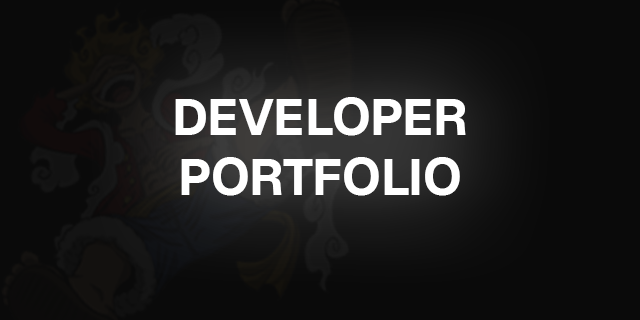
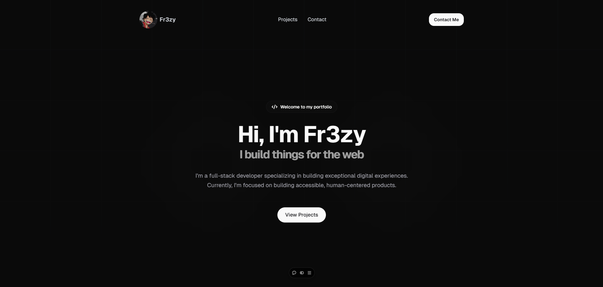

# Fr3zy - Portfolio Website

A modern and responsive portfolio website to showcase my projects, skills, and experiences. Built with Next.js and styled using Tailwind CSS, this portfolio provides a seamless user experience with smooth animations and an organized layout.

## Features

- **Responsive Design**: Optimized for all devices, including mobile, tablet, and desktop.
- **Dark Theme**: Provides a visually appealing dark theme.
- **Smooth Animations**: Utilizes Framer Motion for animations.

## Technologies Used

- **Next.js**: React framework for building static and dynamic websites.
- **Tailwind CSS**: Utility-first CSS framework for rapid UI development.
- **Framer Motion**: Animation library for React to create smooth transitions and effects.
- **GitHub API**: Fetches the latest GitHub projects dynamically.

## Getting Started

### Prerequisites

- [Node.js](https://nodejs.org/) (v14 or later)
- [Git](https://git-scm.com/)

### Installation

1. Clone the repository:

   ```bash
   git clone https://github.com/fr3zyy/portfolio-website.git
   ```

2. Navigate into the project directory:

   ```bash
   cd portfolio-website
   ```

3. Install dependencies:

   ```bash
   npm install
   ```

4. Start the development server:

   ```bash
   npm run dev
   ```

5. Open [http://localhost:3000](http://localhost:3000) to view it in the browser.


## Spotify Recent Tracks Integration

### Setup Steps:

1. Create Spotify App in [Spotify Developer Dashboard](https://developer.spotify.com/dashboard)
   - Add `http://localhost:3333/callback` in Redirect URIs

2. Install dependencies:
   ```bash
   npm install dotenv express open node-fetch
   ```

3. Create `.env` and add:
   ```env
   SPOTIFY_CLIENT_ID=your_client_id
   SPOTIFY_CLIENT_SECRET=your_client_secret
   ```

4. Get refresh token:
   ```bash
   node scripts/spotify-auth.js
   ```
   - Copy token and add to `.env`:
   ```env
   SPOTIFY_REFRESH_TOKEN=your_refresh_token
   ```

5. Enable in config:
   ```js
   recentTracks: true
   ```

6. Restart server:
   ```bash
   npm run dev
   ```

That's it! Your recent Spotify tracks will now appear in your portfolio. 🎵



